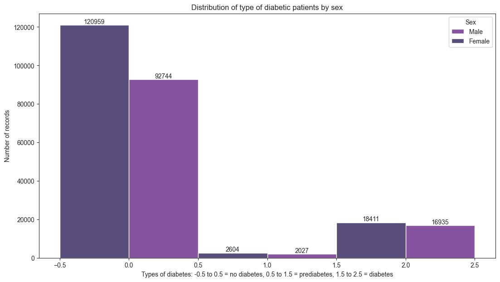
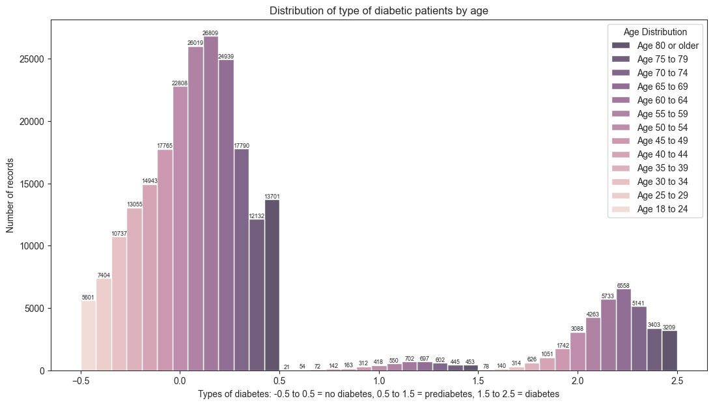
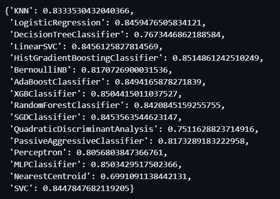
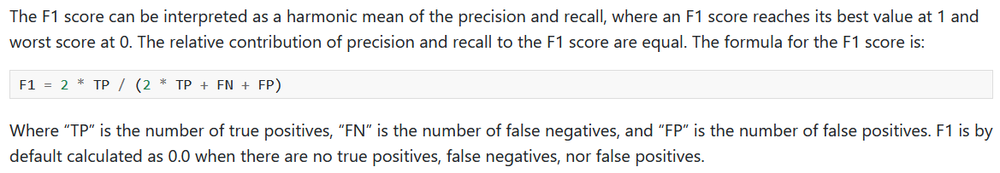
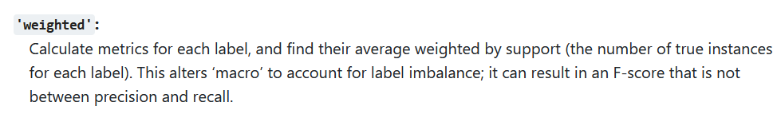
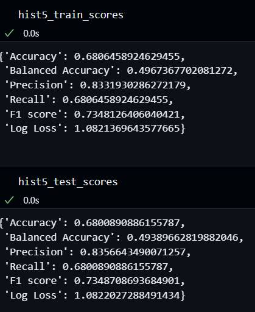

## Sample project for detection of diabetes through various health metrics

### Introduction
The project aims to create a framework for low budget health clinics to implement a semi automated system for detecting when a person has diabetes. The project can also be independently deployed to provide a rudimentary 
source of diagonistic tools directly to the consumer.

In this repository, the main model chosen is a HistGradientBoostingClassifer which is much faster than the GradientBoostingClassifier for big datasets, according to [scikit-learn](https://scikit-learn.org/stable/modules/generated/sklearn.ensemble.HistGradientBoostingClassifier.html).

### Datasets
In the project, the main dataset used is the `diabetes_012_health_indicators_BRFSS2015.csv` file from [Diabetes Health Indicators Dataset from Kaggle](https://www.kaggle.com/datasets/alexteboul/diabetes-health-indicators-dataset?rvi=1) 
which contains 253,680 survey responses to the CDC's BRFSS2015. The target variable `Diabetes_012` has 3 classes. 0 is for no diabetes or only during pregnancy, 1 is for prediabetes, and 2 is for diabetes. There is class imbalance in this dataset. This dataset has 21 feature variables. The distribution of the target value is as; 213703 values for 0 class, 4631 values for 1 class, and 35346 values for 2 class.

The distribution of the differnt values of the target class according to sex is as follows:

#### About the dataset, from Kaggle:

> The Behavioral Risk Factor Surveillance System (BRFSS) is a health-related telephone survey that is collected annually by the CDC. Each year, the survey collects responses from over 400,000 Americans on health-related risk behaviors, chronic health conditions, and the use of preventative services. It has been conducted every year since 1984. For this project, a csv of the dataset available on Kaggle for the year 2015 was used. This original dataset contains responses from 441,455 individuals and has 330 features. These features are either questions directly asked of participants, or calculated variables based on individual participant responses.

## Models

The model that was chosen among 16 different models is the HistGradientBoostingClassifier model due to its initial high score and it being relatively easier to tune. 

The scores of the models that were initially tested out are:

The model has undergone 5 different iterations, each taking around 40-45 minutes to train based on the number of hyperparameters to tune. 

## Evaluation Metric

The model is optimized by the f1 score to account for a balanced prescision and recall score instead of trading one for another. 

`f1_weighted` is used because of the high class imbalance present in the data. 

## Results

The scores of the final model that was tuned and is presented is:

